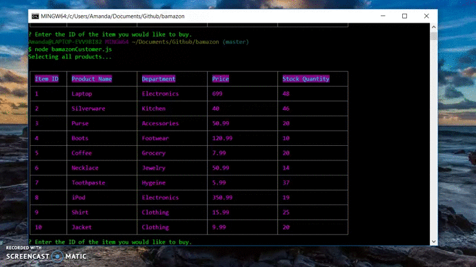

<h1>Bamazon App<h1>

The purpose of this app was to create an Amazon-like storefront using Node.js and MySQL.

Users are prompted with a listing of available items, their item numbers, departments, prices, and how many are left in stock.

If a user wishes to purchase an item, they will be asked to select the desired item's number. After they input the item number, the inventory is updated and the user will be given a total price. The storefront will be displayed again with the updated information.

If the user selects more than what is in stock, they will be informed that not enough of that item is in stock.

